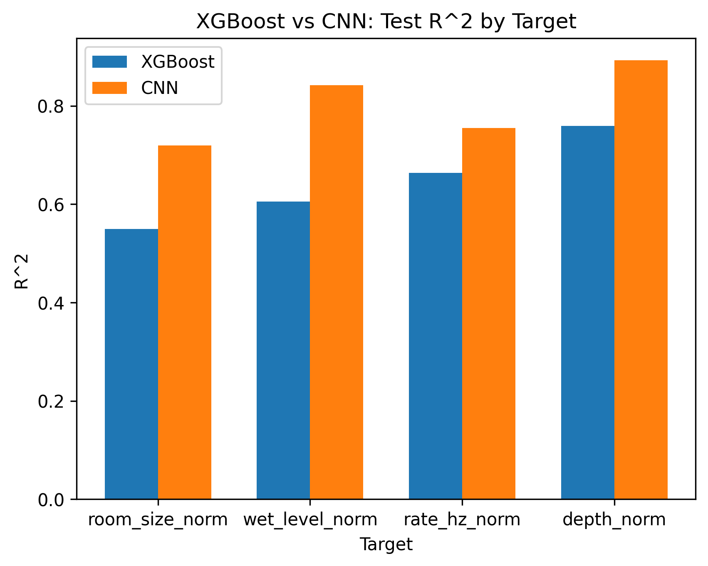

# Guitar FX Parameter Predictor

ML-проект по восстановлению параметров гитарных эффектов **Reverb + Chorus** по обработанному аудио.

Задача сформулирована как multi-output regression. Модель предсказывает 4 параметра:

- `room_size`
- `wet_level`
- `rate_hz`
- `depth`

В проекте сравниваются два подхода:

- XGBoost на аудиопризнаках, извлечённых через `librosa`
- PyTorch CNN на Mel-spectrogram

## Результаты

| Модель | Mean MAE | Mean RMSE | Mean R2 |
|---|---:|---:|---:|
| XGBoost | 0.1326 | 0.1723 | 0.6444 |
| CNN | **0.0938** | **0.1270** | **0.8024** |

CNN снизила средний MAE примерно на **29%** и показала лучший R^2 по всем четырём параметрам.



### R² по параметрам

| Параметр | XGBoost | CNN |
|---|---:|---:|
| Room Size | 0.549 | **0.720** |
| Wet Level | 0.605 | **0.842** |
| Chorus Rate | 0.663 | **0.755** |
| Chorus Depth | 0.760 | **0.893** |

## Данные

Датасет синтетически сгенерирован из чистых гитарных записей с помощью `pedalboard`.

Для каждого исходного аудио создавалось несколько вариантов с разными параметрами Reverb и Chorus.

Разделение данных выполнено по `source_id`, чтобы один исходный guitar sample не попадал одновременно в train, validation и test.

- Train: 2415 записей
- Validation: 515
- Test: 520

## XGBoost

Для табличной модели через `librosa` извлекались:

- RMS
- spectral centroid, bandwidth и rolloff
- zero crossing rate
- MFCC
- MFCC delta и delta-delta
- chroma
- spectral contrast

Расширение feature engineering заметно улучшило качество модели.

Итоговый результат XGBoost:

**Test Mean R^2 = 0.644**

## PyTorch CNN

Для CNN аудио преобразуется в Mel-spectrogram:

```text
Audio
  ↓
Mel-spectrogram
  ↓
Power to dB
  ↓
Normalization
  ↓
CNN
  ↓
4 параметра эффектов
